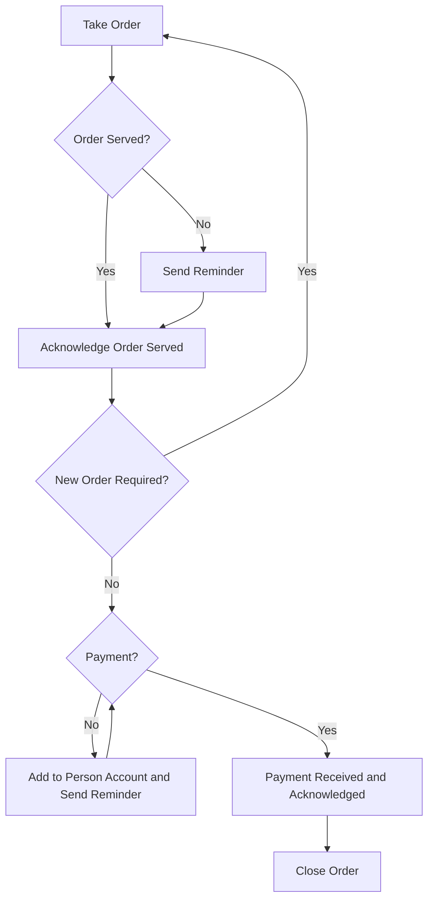
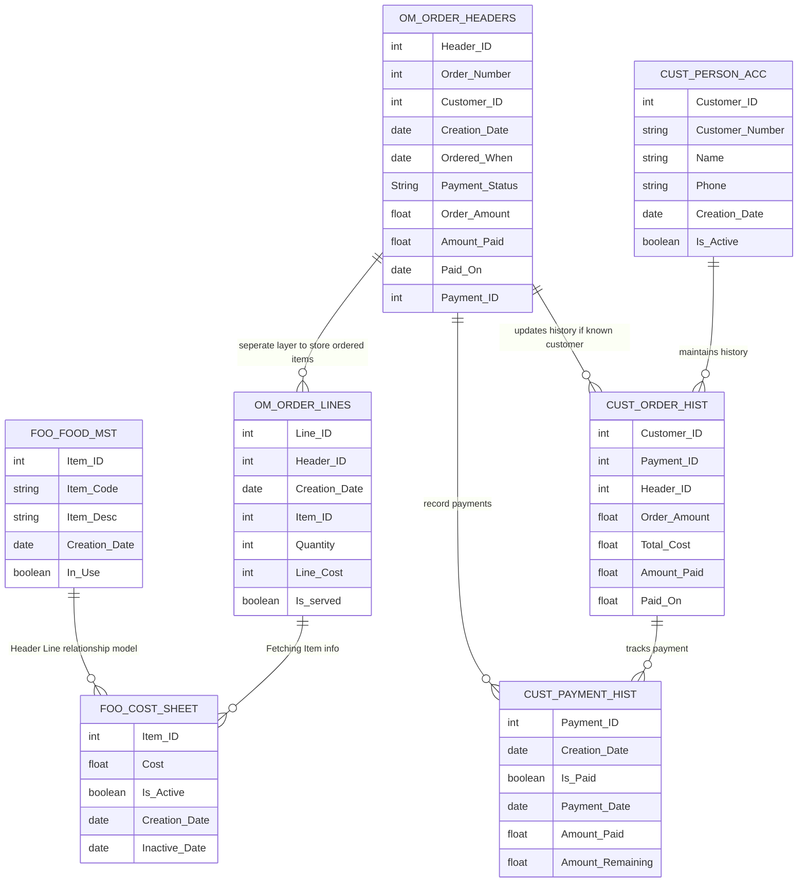

# Annapurna

Canteen management system created for book-keeping purposes. App created for simple CRUD operations to create, track, fulfil food orders. Deployed in a stack of multiple docker containers to avoid dependency hell. I'm very dumb and stingy to pay and follow some course to learn all this so I'll be raw-dogging an entire application by reading docs, vibe-coding, correcting that vibe-coded slop and then blaming myself for not learning all this while in college. If you are interested in setting up this app for your own canteen, do message me. (and do please pay me, motorcycling is not a cheap hobby :') )


# Why is annapurna created?
Solving a real-world problem, in a small scale food canteen where every order created is maintained on a physical book; it's difficult to back-track and find deferred orders. This digital application will resolve the issue to  back-tracking and provided added bonus of daily scheduled EoD reports for KPIs

## Approach
Nothing much to say here, just refer the flow chart



## Tech Stack

- **Front-End :** React TypeScript (not that good of a front-end dev so going for type safety)
- **Backend:** Java Springboot
- **Database:** PostgreSQL

## DB Schema

Creating custom DB schema based on the flowchart




## Wanna deploy it?

**Dependencies:** 
 - Arch Linux (btw 'cause I have a potato laptop and got to manual package installation for optimized performance but you do you and get your preferred linux distro)
 - Docker and docker compose (easily available on official arch repo)
 - Java 17 (not too old, not too cutting edge, suitable for LTS)
 - PostgreSQL 15 (got that in-built notification feature)
 - NodeJs and NPM
 - Portainer (optional, just a GUI for docker container, really helpful tho if you sshing in prod env)
 
**Steps**

```
$ https://github.com/bleak-alpha/annapurna.git
$ cd annapurna
$ docker-compose up
```

and all set (iykyk)
